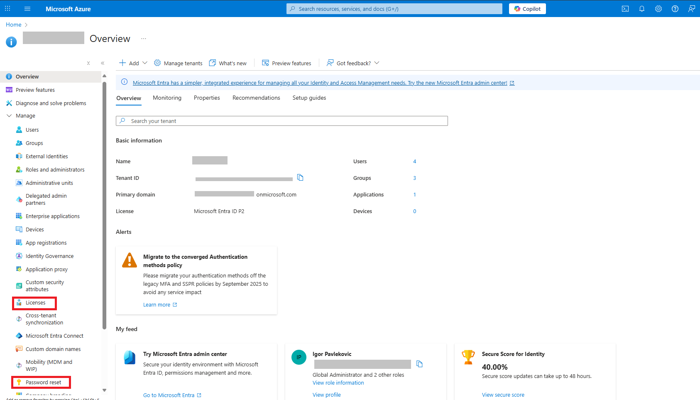
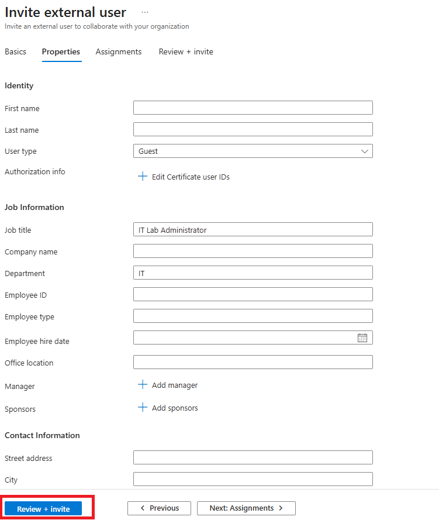
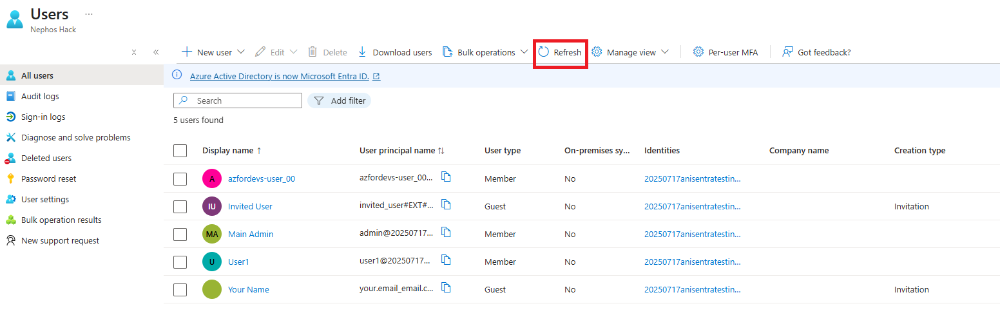
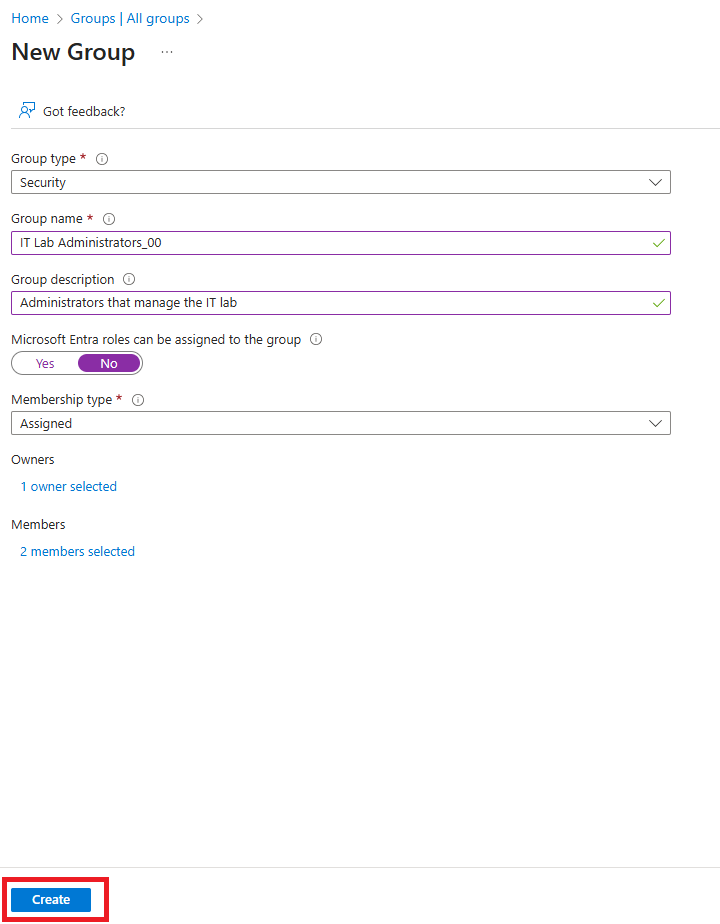
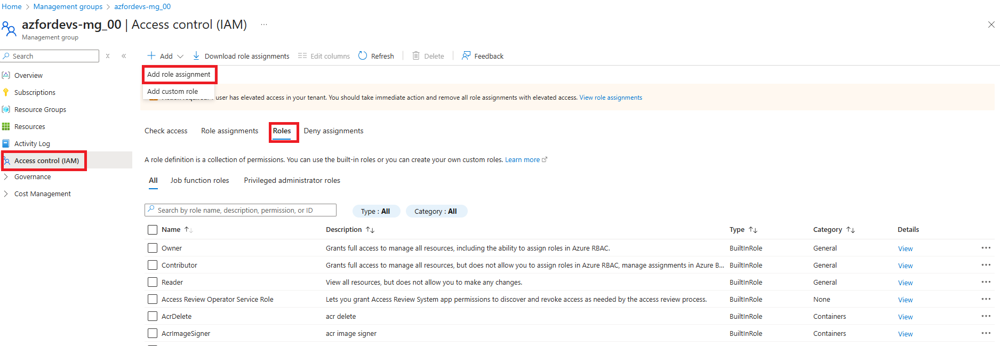

---
lab:
    title: 'Lab 01: Manage Microsoft Entra ID Identities'
    module: 'Exploring Azure Identity (Entra ID)'
---

# Lab 01 - Manage Microsoft Entra ID Identities

## Estimated timing: 45 minutes

## Prerequisites
Azure subscription

## Tasks

+ Task 1: Create and configure user accounts.
+ Task 2: Create groups and add members.
+ Task 3: Implement management groups.
+ Task 4: Review and assign a built-in Azure role.
+ Task 5: Create a custom RBAC role.
+ Task 6: Monitor role assignments with the Activity Log.

## Task 1: Create and configure user accounts

In this task, you will create and configure user accounts. User accounts will store user data such as name, department, location, and contact information.

1. Sign in to the **Azure portal** - `https://portal.azure.com`.

1. Search for and select `Microsoft Entra ID`. Microsoft Entra ID is Azure's cloud-based identity and access management solution. Take a few minutes to familiarize yourself with some of the features listed in the left pane. 

1. Explore options such as **Licenses** and **Password reset**.

### Create a new user

1. Select **Users**, then in the **New user** drop-down select **Create new user**. 

2. Create a new user with the following settings (leave others with their defaults). On the **Properties** tab notice all the different types of information that can be included in the user account. 
    | Setting | Value |
    | --- | --- |
    | User principal name | `azfordevs-user_STUDENT_ID` |
    | Display name | `azfordevs-user_STUDENT_ID` |
    | Auto-generate password | **checked** |
    | Account enabled | **checked** |
    | Job title (Properties tab) | `IT Lab Administrator` |
    | Department (Properties tab) | `IT` |
    | Usage location (Properties tab) | **United States** |
>***Note***: If your student id is 00, then your **User principal name** will be *azfordevs-user_00*, and your **Display name** will be *azfordevs-user_00*
3. Once you have finished reviewing, select **Review + create** and then **Create**.

1. Refresh the page and confirm your new user was created. 

### Invite an external user

1. In the **New user** drop-down select **Invite an external user**. 

    | Setting | Value |
    | --- | --- |
    | Email | your email address |
    | Display name | your name |
    | Send invite message | **check the box** |
    | Message | `Welcome to Azure and our group project` |

    
1. Move to the **Properties** tab. Complete the basic information, including these fields. 

    | Setting | Value |
    | --- | --- |
    | Job title  | `IT Lab Administrator` |
    | Department  | `IT` |
    | Usage location (Properties tab) | **United States** |
    
    

1. Select **Review + invite**, and then **Invite**.

1. **Refresh** the page and confirm the invited user was created. You should receive the invitation email shortly. 

    
## Task 2: Create groups and add members

In this task, you will create a group account. Group accounts can include user accounts or devices. These are two basic ways members are assigned to groups: Statically and Dynamically. Static groups require administrators to add and remove members manually.  Dynamic groups update automatically based on the properties of a user account or device. For example, job title. 

1. In the Azure portal, search for and select `Microsoft Entra ID`. In the **Manage** blade, select **Groups**. 

1. Take a minute to familiarize yourself with the group settings in the left pane.

   + **Expiration** lets you configure a group lifetime in days. After that time the group must be renewed by the owner.
   + **Naming policy** lets you configure blocked words and add a prefix or suffix to group names.

1. In the **All groups** blade, select **+ New group** and create a new group.
     

    | Setting | Value |
    | --- | --- |
    | Group type | **Security** |
    | Group name | `IT Lab Administrators_STUDENT_ID` |
    | Group description | `Administrators that manage the IT lab` |
    | Membership type | **Assigned** |

    >**Note**: An Entra ID Premium P1 or P2 license is required for dynamic membership. If other **Membership types** are available, the options will show up in the drop-down. 
    

1. Select **No owners selected**.

1. In the **Add owners** page, search for and **select** yourself (shown in the top right corner) as the owner. Notice you can have more than one owner. 

1. Select **No members selected**.

1. In the **Add members** pane, search for and **select** the **azfordevs-user1** and the **guest user** you invited. Add both of the users to the group. 

1. Select **Create** to deploy the group.

1. **Refresh** the page and ensure your group was created.
 

1. Select the new group and review the **Members** and **Owners** information.

## Task 3: Implement Management Groups

In this task, you will create and configure management groups. Management groups are used to logically organize and segment subscriptions. They allow for RBAC and Azure Policy to be assigned and inherited to other management groups and subscriptions. For example, if your organization has a dedicated support team for Europe, you can organize European subscriptions into a management group to provide the support staff access to those subscriptions (without providing individual access to all subscriptions). In our scenario everyone at the Help Desk will need to create a support request across all subscriptions. 

1. In the **Manage** blade, select **Properties**.

1. Review the **Access management for Azure resources** area. Ensure you can manage access to all Azure subscriptions and management groups in the tenant.
 
   
1. Search for and select `Management groups`.

1. On the **Management groups** blade, click **+ Create**. Or click **Start using management groups**

1. Create a management group with the following settings. Select **Submit** when you are done. 

    | Setting | Value |
    | --- | --- |
    | Management group ID | `azfordevs-mg_STUDENT_ID` (must be unique in the directory) |
    | Management group display name | `azfordevs-mg_STUDENT_ID` |

1. **Refresh** the management group page to ensure your new management group displays. This may take a minute. 

## Task 4: Review and assign a built-in Azure role

In this task, you will review the built-in roles and assign the VM Contributor role to a member of the Help Desk. Azure provides a large number of [built-in roles](https://learn.microsoft.com/azure/role-based-access-control/built-in-roles). 

1. Select the **azfordevs-mg_STUDENT_ID** management group.

1. Select the **Access control (IAM)** blade, and then the **Roles** tab.
 

1. Scroll through the built-in role definitions that are available. **View** a role to get detailed information about the **Permissions**, **JSON**, and **Assignments**. You will often use *owner*, *contributor*, and *reader*. 

1. Select **+ Add**, from the drop-down menu, select **Add role assignment**. 

1. On the **Add role assignment** blade, search for and select the **Virtual Machine Contributor**. The Virtual machine contributor role lets you manage virtual machines, but not access their operating system or manage the virtual network and storage account they are connected to. This is a good role for the IT Lab Administrators. Select **Next**.

1. On the **Members** tab, **Select Members**.

    >**Note:** The next step assigns the role to the **IT Lab Administrators_STUDENT_ID** group. If you do not have a IT Lab Administrators_STUDENT_ID group, take a minute to create it.

1. Search for and select the `IT Lab Administrators_STUDENT_ID` group. Click **Select**. 

1. Click **Review + assign** twice to create the role assignment.

1. Continue on the **Access control (IAM)** blade. On the **Role assignments** tab, confirm the **IT Lab Administrators_STUDENT_ID** group has the **Virtual Machine Contributor** role. 

    >**Note:** As a best practice always assign roles to groups not individuals. 

    
## Task 5: Create a custom RBAC role

In this task, you will create a custom RBAC role. Custom roles are a core part of implementing the principle of least privilege for an environment. Built-in roles might have too many permissions for your scenario. We will also create a new role and remove permissions that are not necessary. Do you have a plan for managing overlapping permissions?

1. Continue working on your management group. Navigate to the **Access control (IAM)** blade.

1. Select **+ Add**, from the drop-down menu, select **Add custom role**.

1. On the Basics tab complete the configuration.

    | Setting | Value |
    | --- | --- |
    | Custom role name | `Custom Support Request STUDENT_ID` |
    | Description | `A custom contributor role for support requests.` |

1. For **Baseline permissions**, select **Clone a role**. In the **Role to clone** drop-down menu, select **Support Request Contributor**.

1. Select **Next** to move to the **Permissions** tab, and then select **+ Exclude permissions**.

1. In the resource provider search field, enter `.Support` and select **Microsoft.Support**.

1. In the list of permissions, place a checkbox next to **Other: Registers Support Resource Provider** and then select **Add**. The role should be updated to include this permission as a *NotAction*.

    >**Note:** An Azure resource provider is a set of REST operations that enable functionality for a specific Azure service. We do not want the Help Desk to be able to have this capability, so it is being removed from the cloned role. 

1. On the **Assignable scopes** tab, ensure your management group is listed, then click **Next**.

1. Review the JSON for the *Actions*, *NotActions*, and *AssignableScopes* that are customized in the role. 
 

1. Select **Review + Create**, and then select **Create**.

## Task 6: Monitor role assignments with the Activity Log

In this task, you view the activity log to determine if anyone has created a new role. 

1. In the portal locate the **azfordevs-mg_STUDENT_ID** resource and select **Activity log**. The activity log provides insight into subscription-level events. 

1. Review the activites for role assignments. The activity log can be filtered for specific operations. 
