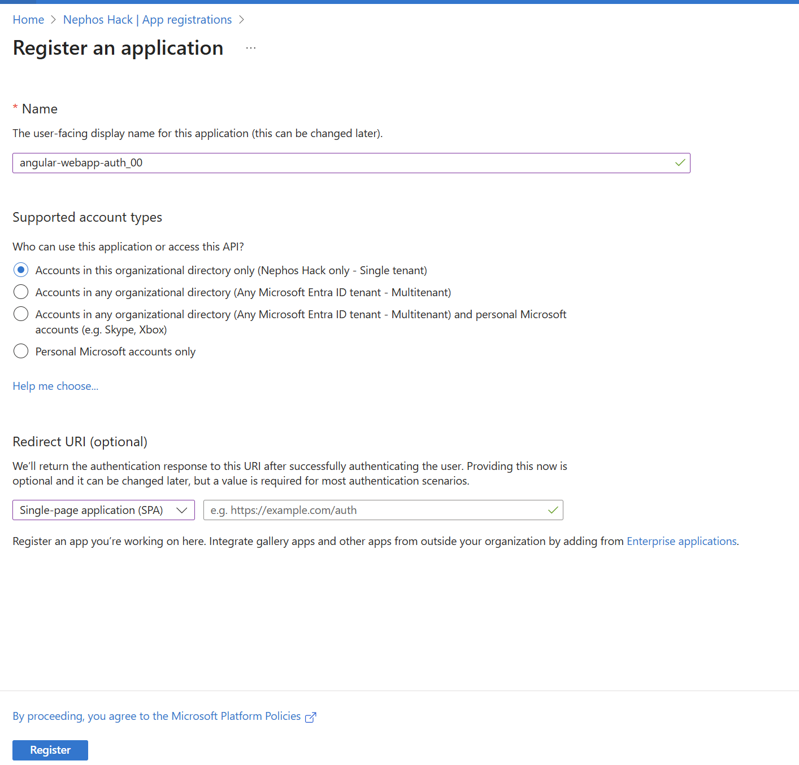
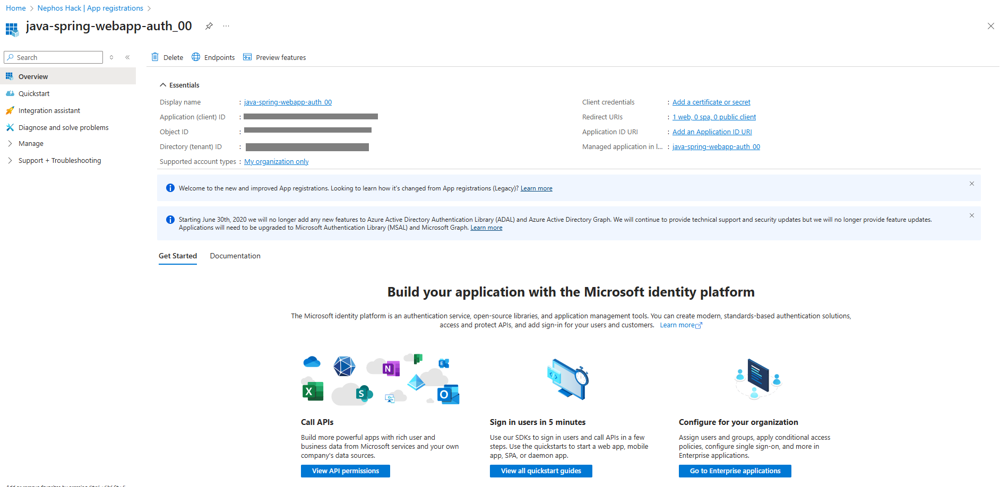

---
lab:
    title: 'Lab 03: Secure Angular Single-page Application using Microsoft Entra ID'
    module: 'Implement user authentication and authorization'
---

# Lab 03 - Secure Angular Single-page Application using Microsoft Entra ID


## Estimated timing: 80 minutes

## Prerequisites
- Azure subscription
- Angular CLI
- Node js. 18.19 or newer
- Visual Studio Code

## Tasks

+ Task 1: Register the Application in Microsoft Entra ID
+ Task 2: Create a new Angular project
+ Task 3: Configure application settings
+ Task 4: Add authentication code to the application
+ Task 5: Add sign-in and sign-out functionality to your app
+ Task 6: Extract data to view in the application UI
+ Task 7: Run application

## Task 1: Register the Application in Microsoft Entra ID
1. Sign in to the Azure Portal (https://portal.azure.com).
1. Navigate to Microsoft Entra ID > App registrations > New registration.
1. Fill in the form:
    - Name: 
    ```
    angular-webapp-auth_STUDENT_ID
    ```
    - Supported account types: Accounts in this organizational directory only

    - In the Redirect URI (optional) section, select Web in the combo-box and enter the following redirect URI:
    ```
    http://localhost:4200/
    ```
     
 1. Click Register.

1. On the app's registration page, find and copy the *Application (client) ID* and *Directory (tenant) ID* values to use later. You'll use those values in your app's configuration file or files.
 

## Task 2: Create a new Angular project

1. Open terminal and run the following command to create a new Angular project:
    ```
    ng new aisd-angular-00 --routing=true --style=css --strict=false
    ```
    >***Note:*** For name of new project use *aisd-angular-STUDENT_ID*, so if your **STUDENT_ID** is **00**, name of the project would be *aisd-angular-00*.
1. For question: Do you want to enable Server-Side Rendering (SSR) and Static Site Generation (SSG/Prerendering)? Select *No*.
1. In terminal change to the project directory.
    ```
    cd aisd-angular-00
    ```
1. Install app dependencies:
    ```
    npm install @azure/msal-browser @azure/msal-angular bootstrap
    ```
1. Open angular.json and add Bootstrap's CSS path to the styles array:
    ```
    "styles": [
        "src/styles.css",
        "node_modules/bootstrap/dist/css/bootstrap.min.css"
    ],
    ```
1. Generate Home and Profile components:
    ```
    ng generate component home
    ng generate component profile
    ```
1. Remove unnecessary files and code from the project:
    ```
    del src\app\app.component.css
    del src\app\app.component.spec.ts
    del src\app\home\home.component.css
    del src\app\home\home.component.spec.ts
    del src\app\profile\profile.component.css
    del src\app\profile\profile.component.spec.ts
    ```
1. Rename **app.routes.ts** to **app-routing.module.ts** and update all references of app.routes.ts throughout the application.
1. Rename **app.config.ts** to **app.module.ts** using Visual Studio Code and update all references to app.config.ts throughout the application.

## Task 3: Configure application settings
1. Open the ***src/app/app.module.ts*** file and replace the contents with the following code:
    ```typescript
    import { BrowserModule } from '@angular/platform-browser';
    import { NgModule } from '@angular/core';
    import { AppRoutingModule } from './app-routing.module';
    import { AppComponent } from './app.component';
    import { ProfileComponent } from './profile/profile.component';
    import { HomeComponent } from './home/home.component';
    import { HTTP_INTERCEPTORS, HttpClientModule } from '@angular/common/http';
    import { IPublicClientApplication, PublicClientApplication, InteractionType, BrowserCacheLocation, LogLevel } from '@azure/msal-browser';
    import { MsalGuard, MsalInterceptor, MsalBroadcastService, MsalInterceptorConfiguration, MsalModule, MsalService, MSAL_GUARD_CONFIG, MSAL_INSTANCE, MSAL_INTERCEPTOR_CONFIG, MsalGuardConfiguration, MsalRedirectComponent } from '@azure/msal-angular';

    const isIE = window.navigator.userAgent.indexOf('MSIE ') > -1 || window.navigator.userAgent.indexOf('Trident/') > -1;

    export function MSALInstanceFactory(): IPublicClientApplication {
    return new PublicClientApplication({
        auth: {
        // 'Application (client) ID' of app registration in the Microsoft Entra admin center - this value is a GUID
        clientId: "Enter_the_Application_Id_Here",
        // Full directory URL, in the form of https://login.microsoftonline.com/<tenant>
        authority: "https://login.microsoftonline.com/Enter_the_Tenant_Info_Here",
        // Must be the same redirectUri as what was provided in your app registration.
        redirectUri: "http://localhost:4200",
        },
        cache: {
        cacheLocation: BrowserCacheLocation.LocalStorage,
        storeAuthStateInCookie: isIE
        }
    });
    }

    export function MSALInterceptorConfigFactory(): MsalInterceptorConfiguration {
    const protectedResourceMap = new Map<string, Array<string>>();
    protectedResourceMap.set('https://graph.microsoft.com/v1.0/me', ['user.read']);

    return {
        interactionType: InteractionType.Redirect,
        protectedResourceMap
    };
    }

    export function MSALGuardConfigFactory(): MsalGuardConfiguration {
    return { 
        interactionType: InteractionType.Redirect,
        authRequest: {
        scopes: ['user.read']
        }
    };
    }

    @NgModule({
    declarations: [
        AppComponent,
        HomeComponent,
        ProfileComponent
    ],
    imports: [
        BrowserModule,
        AppRoutingModule,
        HttpClientModule,
        MsalModule
    ],
    providers: [
        {
        provide: HTTP_INTERCEPTORS,
        useClass: MsalInterceptor,
        multi: true
        },
        {
        provide: MSAL_INSTANCE,
        useFactory: MSALInstanceFactory
        },
        {
        provide: MSAL_GUARD_CONFIG,
        useFactory: MSALGuardConfigFactory
        },
        {
        provide: MSAL_INTERCEPTOR_CONFIG,
        useFactory: MSALInterceptorConfigFactory
        },
        MsalService,
        MsalGuard,
        MsalBroadcastService
    ],
    bootstrap: [AppComponent, MsalRedirectComponent]
    })
    export class AppModule { }
    ```
1. Replace **Enter_the_Application_Id_Here** with the **Application (client) ID** from the app registration.
1. Replace **Enter_the_Tenant_Info_Here** with the **Directory (tenant) ID** from the app registration.
1. Save file.

>***Note:*** djdlja

## Task 4: Add authentication code to the application
1. Open ***src/app/app.component.ts*** file and replace the contents with the following code:
    ```typescript
    import { Component, OnInit, Inject, OnDestroy } from '@angular/core';
    import { MsalService, MsalBroadcastService, MSAL_GUARD_CONFIG, MsalGuardConfiguration } from '@azure/msal-angular';
    import { EventMessage, EventType, InteractionStatus, RedirectRequest } from '@azure/msal-browser';
    import { Subject } from 'rxjs';
    import { filter, takeUntil } from 'rxjs/operators';

    @Component({
    selector: 'app-root',
    templateUrl: './app.component.html'
    })
    export class AppComponent implements OnInit, OnDestroy {
    title = 'Angular 12 - MSAL Example';
    loginDisplay = false;
    tokenExpiration: string = '';
    private readonly _destroying$ = new Subject<void>();

    constructor(
        @Inject(MSAL_GUARD_CONFIG) private msalGuardConfig: MsalGuardConfiguration,
        private authService: MsalService,
        private msalBroadcastService: MsalBroadcastService
    ) { }

    ngOnInit(): void {
        this.msalBroadcastService.inProgress$
            .pipe(
            filter((status: InteractionStatus) => status === InteractionStatus.None),
            takeUntil(this._destroying$)
        )
        .subscribe(() => {
            this.setLoginDisplay();
        });

        this.msalBroadcastService.msalSubject$.pipe(filter((msg: EventMessage) => msg.eventType === EventType.ACQUIRE_TOKEN_SUCCESS)).subscribe(msg => {
        this.tokenExpiration=  (msg.payload as any).expiresOn;
        localStorage.setItem('tokenExpiration', this.tokenExpiration);
        });
    }

    setLoginDisplay() {
        this.loginDisplay = this.authService.instance.getAllAccounts().length > 0;
    }

    login() {
        if (this.msalGuardConfig.authRequest) {
        this.authService.loginRedirect({ ...this.msalGuardConfig.authRequest } as RedirectRequest);
        } else {
        this.authService.loginRedirect();
        }
    }

    logout() {
        this.authService.logoutRedirect();
    }

    ngOnDestroy(): void {
        this._destroying$.next(undefined);
        this._destroying$.complete();
    }
    }
    ```
1. Save file.
>***Note:*** In this code snippet MSAL is integrated with Angulat to manage user authentication.

## Task 5: Add sign-in and sign-out functionality to your app
1. Open the ***src/app/app.component.html*** and replace the contents with the following code:
    ```html
    <a class="navbar navbar-dark bg-primary " variant="dark" href="/">
        <a class="navbar-brand" > Microsoft Identity Platform </a>
            <a>
                <button *ngIf="!loginDisplay" class="btn btn-secondary" (click)="login()">Sign In</button>
                <button *ngIf="loginDisplay" class="btn btn-secondary" (click)="logout()">Sign Out</button>
            </a>
    </a>
        <a class="profileButton">
            <a [routerLink]="['profile']" class="btn btn-secondary" *ngIf="loginDisplay">View Profile</a> 
        </a>
    <div class="container">
        <router-outlet></router-outlet>
    </div>
    ```
1. Save file.
1. Open the ***src/app/app-routing.module.ts*** and replace the contents with the following code:
    ```typescript
    import { NgModule } from '@angular/core';
    import { Routes, RouterModule } from '@angular/router';
    import { ProfileComponent } from './profile/profile.component';
    import { HomeComponent } from './home/home.component';
    import { MsalGuard } from '@azure/msal-angular';

    const routes: Routes = [
    {
        path: 'profile',
        component: ProfileComponent,
        canActivate: [
        MsalGuard
        ]
    },
    {
        path: '**',
        component: HomeComponent
    }
    ];

    @NgModule({
    imports: [RouterModule.forRoot(routes, {
        useHash: true
    })],
    exports: [RouterModule]
    })
    export class AppRoutingModule { }
    ```
1. Save file.
1. Open the ***src/app/home/home.component.ts*** file and replace the contents with the following code.
    ```typescript
    import { Component, OnInit } from '@angular/core';
    import { MsalBroadcastService, MsalService } from '@azure/msal-angular';
    import { EventMessage, EventType, AuthenticationResult } from '@azure/msal-browser';
    import { filter } from 'rxjs/operators';

    @Component({
    selector: 'app-home',
    templateUrl: './home.component.html'
    })
    export class HomeComponent implements OnInit {
    constructor(
        private authService: MsalService,
        private msalBroadcastService: MsalBroadcastService
    ) { }

    ngOnInit(): void {
        this.msalBroadcastService.msalSubject$
        .pipe(
            filter((msg: EventMessage) => msg.eventType === EventType.LOGIN_SUCCESS),
        )
        .subscribe((result: EventMessage) => {
            const payload = result.payload as AuthenticationResult;
            this.authService.instance.setActiveAccount(payload.account);
        });
    }
    }
    ```
1. Save file.
1. Open the ***src/app/home/home.component.html*** file and replace the contents with the following code.
    ```html
    <div class="title">
        <h5>
            Welcome to the Microsoft Authentication Library For Javascript - Angular SPAx
        </h5>
        <p >View your data from Microsoft Graph by clicking the "View Profile" link above.</p>
    </div>
    ```
1. Save file.
1. Open the ***src/main.ts*** file and replace the contents with the following code.
    ```typescript
    import { platformBrowserDynamic } from '@angular/platform-browser-dynamic';

    import { AppModule } from './app/app.module';

    platformBrowserDynamic().bootstrapModule(AppModule)
    .catch(err => console.error(err));
    ```
1. Save file.
1. Open the ***src/index.html*** file and replace the contents with the following code.
    ```html
    <!doctype html>
    <html lang="en">
    <head>
        <meta charset="utf-8">
        <title>MSAL For Javascript - Angular SPA</title>
    </head>
    <body>
        <app-root></app-root>
        <app-redirect></app-redirect>
    </body>
    </html>
    ```
1. Save file.
1. Open the ***src/styles.css*** file and replace the contents with the following code.
    ```css
    body {
    margin: 0;
    font-family: -apple-system, BlinkMacSystemFont, 'Segoe UI', 'Roboto', 'Oxygen',
        'Ubuntu', 'Cantarell', 'Fira Sans', 'Droid Sans', 'Helvetica Neue',
        sans-serif;
    -webkit-font-smoothing: antialiased;
    -moz-osx-font-smoothing: grayscale;
    }

    code {
    font-family: source-code-pro, Menlo, Monaco, Consolas, 'Courier New',
        monospace;
    }

    .app {
    text-align: center;
    padding: 8px;
    }

    .title{
    text-align: center;
    padding: 18px;
    }


    .profile{
    text-align: center;
    padding: 18px;
    }

    .profileButton{
    display: flex;
    justify-content: center;
    padding: 18px;
    }
    ```
1. Save file.

## Task 6: Extract data to view in the application UI
1. Open the ***src/app/profile/profile.component.ts*** file and replace the contents with the following code snippet:
    ```typescript
    import { Component, OnInit } from '@angular/core';
    import { HttpClient } from '@angular/common/http';

    type ProfileType = {
    businessPhones?: string,
    displayName?: string,
    givenName?: string,
    jobTitle?: string,
    mail?: string,
    mobilePhone?: string,
    officeLocation?: string,
    preferredLanguage?: string,
    surname?: string,
    userPrincipalName?: string,
    id?: string
    }

    @Component({
    selector: 'app-profile',
    templateUrl: './profile.component.html'
    })
    export class ProfileComponent implements OnInit {
    profile!: ProfileType;
    tokenExpiration!: string;

    constructor(
        private http: HttpClient
    ) { }

    ngOnInit() {
        this.http.get('https://graph.microsoft.com/v1.0/me')
        .subscribe(profile => {
            this.profile = profile;
        });

        this.tokenExpiration = localStorage.getItem('tokenExpiration')!;
    }
    }
    ```
1. Save fie.
1. Open the ***src/app/profile/profile.component.html*** file and replace the contents with the following code snippet:
    ```html
    <div class="profile">
        <p><strong>Business Phones:</strong> {{profile?.businessPhones}}</p>
        <p><strong>Display Name:</strong> {{profile?.displayName}}</p>
        <p><strong>Given Name:</strong> {{profile?.givenName}}</p>
        <p><strong>Job Title:</strong> {{profile?.jobTitle}}</p>
        <p><strong>Mail:</strong> {{profile?.mail}}</p>
        <p><strong>Mobile Phone:</strong> {{profile?.mobilePhone}}</p>
        <p><strong>Office Location:</strong> {{profile?.officeLocation}}</p>
        <p><strong>Preferred Language:</strong> {{profile?.preferredLanguage}}</p>
        <p><strong>Surname:</strong> {{profile?.surname}}</p>
        <p><strong>User Principal Name:</strong> {{profile?.userPrincipalName}}</p>
        <p><strong>Profile Id:</strong> {{profile?.id}}</p>
        <br><br>
        <p><strong>Token Expiration:</strong> {{tokenExpiration}}</p>
        <br><br>
        <p>Refreshing this page will continue to use the cached access token until it nears expiration, at which point a new access token will be requested.</p>
    </div>
    ```
1. Save file.

## Task 7: Run application

1. Run the following command in terminal:
    ```bash
    ng serve --open
    ```
1. Open a browser and go to http://localhost:4200.
1. You should be redirected to the Microsoft Entra ID login page.
1. Sign in with a user from your tenant.
1. Check Profile. 
1. Sign out.