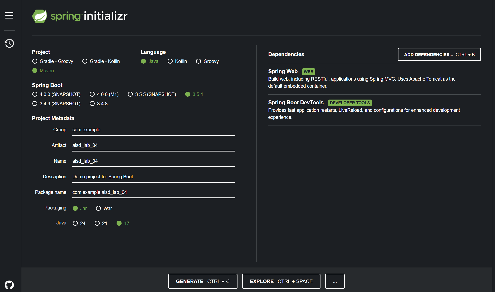

---
lab:
    title: 'Lab 04: Access resource secrets more securely across services'
    module: 'Implement secure cloud solutions'
---

# Lab 04 - Access resource secrets more securely across services


## Estimated timing: 60 minutes

## Prerequisites
- Azure subscription
- Azure CLI installed
- Java 17+ and Maven


## Tasks

+ Task 1: Create a resource group using the Azure CLI
+ Task 2: Create a key vault 
+ Task 3: Give your user account permissions to manage secrets in Key Vault
+ Task 4: Create Azure App Configuration
+ Task 5: Give your user account permissions to manage configurations
+ Task 6: Add a secret to Key Vault 
+ Task 7: Retrieve a secret from Key Vault
+ Task 8: Add configuration setting
+ Task 9: Generate the Spring Boot Project
+ Task 10: Add Azure SDK Dependencies
+ Task 11: Create Java Class AzureService
+ Task 12: Create Java Class SecretController
+ Task 13: Run application

## Task 1: Create a resource group using the Azure CLI
1. A resource group is a logical container into which Azure resources are deployed and managed. Use the *az group create* command to create a resource group named ***aisd-resource-group_STUDENT_ID*** in the *eastus* location.

    ```
    az group create --name "aisd-resource-group_STUDENT_ID" --location "EastUS"
    ```

## Task 2: Create a key vault
1. Use the Azure CLI *az keyvault create* command to create a Key Vault in the resource group from the previous task.
1. For the name use ***aisd-keyvault-STUDENT_ID***.

    ```
    az keyvault create --name "aisd-keyvault-STUDENT_ID" --resource-group "aisd-resource-group_STUDENT_ID"
    ```
1. The output of this command shows properties of the newly created key vault, important ones are *Vault Name* and *Vault URL*. Copy and save them for later.


## Task 3: Give your user account permissions to manage secrets in Key Vault

1. To gain permissions to your key vault through Role-Based Access Control (RBAC), assign a role to your "User Principal Name" (UPN) using the Azure CLI command *az role assignment create*.

    ```
    az role assignment create --role "Key Vault Secrets Officer" --assignee "<upn>" --scope "/subscriptions/<subscription-id>/resourceGroups/<resource-group-name>/providers/Microsoft.KeyVault/vaults/<your-keyvault-name>"
    ```
>***Note:*** Replace <upn>, <subscription-id>, <resource-group-name> and <your-keyvault-name> with your real values. Your UPN will typically be in the format of an email address (e.g., username@domain.com).

## Task 4: Create Azure App Configuration
1. To register provider use:
    ```bash
    az provider register --namespace "Microsoft.AppConfiguration"
    ```
1. This can take few minutes. 
1. To check registration status enter:
    ```bash
    az provider show --namespace "Microsoft.AppConfiguration" --query "registrationState"
    ```
1. Enter this command to create App Configuration:
    ```bash
    az appconfig create --name aisd-config-STUDENT_ID --resource-group aisd-resource-group_STUDENT_ID --location "EastUS"
    ```
1. The output of this command shows properties of the newly created application configuration. There is some important information and among them is *Endpoint*. Copy and save it for later.


## Task 5: Give your user account permissions to manage configurations

1. To gain permissions to your app configuration through Role-Based Access Control (RBAC), assign a role to your "User Principal Name" (UPN) using the Azure CLI command *az role assignment create*.

    ```
    az role assignment create --role "App Configuration Data Reader" --assignee "<upn>" --scope "/subscriptions/<subscription-id>/resourceGroups/<resource-group-name>/providers/Microsoft.AppConfiguration/configurationStores/<your-app-config-name>"
    ```
>***Note:*** Replace <upn>, <subscription-id>, <resource-group-name> and <your-app-config-name> with your real values. Your UPN will typically be in the format of an email address (e.g., username@domain.com).

## Task 6: Add a secret to Key Vault
1. Use the Azure CLI *az keyvault secret set* command below to create a secret in Key Vault called ***AISD-Example-STUDENT_ID*** that will store the value ***hVFkk965BuUv*** :
```
az keyvault secret set --vault-name "aisd-keyvault-STUDENT_ID" --name "AISD-Example-STUDENT_ID" --value "hVFkk965BuUv"
```

## Task 7: Retrieve a secret from Key Vault
1. To view the value contained in the secret as plain text, use the Azure CLI *az keyvault secret show* command:
```
az keyvault secret show --name "AISD-Example-STUDENT_ID" --vault-name "aisd-keyvault-STUDENT_ID" --query "value"
```

## Task 8: Add configuration setting
1. Use the Azure CLI *az appconfig kv set* command below to create a key called ***FeatureFlag:BetaFeature***  with value ***true***:
    ```bash
    az appconfig kv set --name aisd-config-STUDENT_ID --key "FeatureFlag:BetaFeature" --value "true"
    ```


## Task 9: Generate the Spring Boot Project
1. Go to: https://start.spring.io
1. Fill the following information:
    - Project: Maven
    - Language: Java
    - Spring Boot: 3.5.4 or later
    - Group: com.example
    - Artifact: aisd_lab_04
    - Name: aisd_lab_04
    - Packaging: Jar
    - Java: 17 or 21
1. Add dependencies:
    - Spring Web
    - Spring Boot DevTools
 
1. Click Generate to download the ZIP file.
1. Extract the ZIP and open it in your IDE.

## Task 10: Add Azure SDK Dependencies
1. Open *pom.xml* and add these inside **dependencies**:
    ```xml
    <dependency>
        <groupId>com.azure</groupId>
        <artifactId>azure-security-keyvault-secrets</artifactId>
        <version>4.6.0</version>
    </dependency>
    <dependency>
        <groupId>com.azure</groupId>
        <artifactId>azure-identity</artifactId>
        <version>1.10.0</version>
    </dependency>
    <dependency>
        <groupId>com.azure</groupId>
        <artifactId>azure-data-appconfiguration</artifactId>
        <version>1.4.0</version>
    </dependency>
    ```
1. Open terminal and run command:
```bash
mvn clean install
```

## Task 11: Create Java Class AzureService
1. Create file ***AzureService.java***. You ca create it in  *com.example.aisd_lab_04.service*
1. Paste this code inside:
    ```java
    package com.example.aisd_lab_04.service;

    import com.azure.identity.DefaultAzureCredentialBuilder;
    import com.azure.security.keyvault.secrets.SecretClient;
    import com.azure.security.keyvault.secrets.SecretClientBuilder;
    import com.azure.data.appconfiguration.ConfigurationClient;
    import com.azure.data.appconfiguration.ConfigurationClientBuilder;
    import com.azure.data.appconfiguration.models.ConfigurationSetting;
    import org.springframework.stereotype.Service;

    @Service
    public class AzureService {

        private final SecretClient secretClient;
        private final ConfigurationClient configClient;

        public AzureService() {
            secretClient = new SecretClientBuilder()
            //Your Vault URL
                    .vaultUrl("YOUR_VAULT_URL")
                    .credential(new DefaultAzureCredentialBuilder().build())
                    .buildClient();

            configClient = new ConfigurationClientBuilder()
                    .credential(new DefaultAzureCredentialBuilder().build())
                    //Your config endpoint
                    .endpoint("YOUR_CONFIG_ENDPOINT")
                    .buildClient();
        }

        public String getSecret() {
            //Your secret name
            return secretClient.getSecret("YOUR_SECRET_NAME").getValue();
        }
        
        public String getFeatureFlag() {
        ConfigurationSetting setting = configClient.getConfigurationSetting("FeatureFlag:BetaFeature", null);
        return setting.getValue();
    }
    }
    ```
>***Note:*** Change *YOUR_VAULT_URL*, *YOUR_CONFIG_ENDPOINT* and *YOUR_SECRET_NAME*
1. Save file.

## Task 12: Create Java Class SecretController
1. Create file ***SecretController.java***. You ca create it in  *com.example.aisd_lab_04.controller*
1. Paste this code inside:
    ```java
    package com.example.aisd_lab_04.controller;

    import com.example.lab4.service.AzureService;
    import org.springframework.web.bind.annotation.GetMapping;
    import org.springframework.web.bind.annotation.RestController;

    @RestController
    public class SecretController {

        private final AzureService azureService;

        public SecretController(AzureService azureService) {
            this.azureService = azureService;
        }

        @GetMapping("/secret")
        public String getSecret() {
            return azureService.getSecret();
        }
        
        @GetMapping("/feature-flag")
        public String getFeatureFlag() {
            return azureService.getFeatureFlag();
        }
    }
    ```
1. Save file.

## Task 13: Run application
1. Run the app:
    ```bash
    mvn spring-boot:run
    ```
1. Test application: 
    -  http://localhost:8080/secret
    - http://localhost:8080/feature-flag

## Bonus: Clean up resources.
1. When no longer needed, you can use the Azure CLI ***az group delete*** command to remove the resource group and all related resources:
    ```
    az group delete --name "aisd-resource-group_STUDENT_ID"
    ```